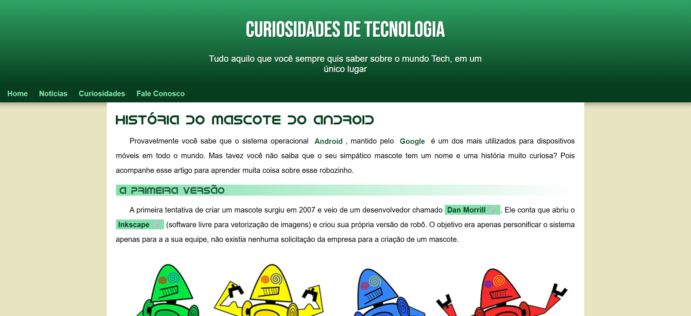

# 🤖 Projeto Android

## 📖 Sobre o Projeto

Este projeto foi desenvolvido durante o curso de HTML5 e CSS3 do professor Gustavo Guanabara, do Curso em Vídeo.

O objetivo foi criar uma página responsiva contando a história do mascote Android, aplicando conceitos fundamentais de desenvolvimento web como estruturação semântica, estilização com CSS e responsividade.

## 🚀 Funcionalidades

- Layout responsivo
- Uso de fontes personalizadas
- Vídeo incorporado do YouTube
- Imagens adaptáveis
- Estrutura semântica em HTML5
- Menu de navegação
- Efeitos visuais com CSS

## 🛠️ Tecnologias Utilizadas

- HTML5
- CSS3

## 📱 Responsividade

O projeto foi desenvolvido para oferecer uma boa experiência em:

- 💻 Computadores
- 📱 Smartphones
- 📟 Tablets

## 📷 Preview

## 🔗 Acesse o Projeto

👉 [Clique aqui para visualizar](https://SEU-USUARIO.github.io/NOME-DO-REPOSITORIO/)

## 📚 Aprendizados

Durante este desafio foram praticados conceitos importantes como:

- Hierarquia de títulos
- Seletores CSS
- Variáveis CSS
- Responsividade
- Flexibilidade de imagens
- Organização de código
- Boas práticas de HTML semântico

## 👨‍🏫 Créditos

Projeto proposto pelo professor Gustavo Guanabara através do Curso em Vídeo.

## 👩‍💻 Desenvolvido por

Kauane Mota

[Meu GitHub](https://github.com/SEU-USUARIO)